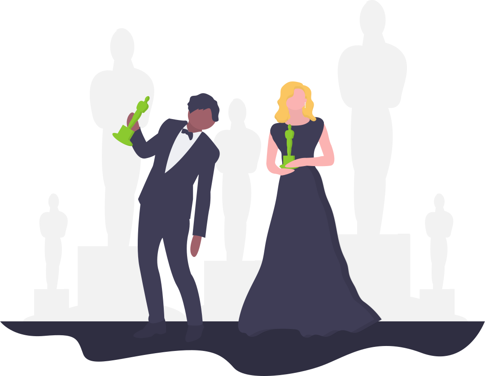

# 

The shoppies app is a SPA built in React that allows users to search for movies (through OMDB's end points) and nominate five movies to receive a Shoppie Award.

## About Me

Hi! 👋 I'm Nicolle, a graduate from Hackbright Academy’s software engineering program and currently a software engineer intern at PagerDuty. As part of the front-end growth team, I help build and maintain the front-end for customer onboarding, checkout, and trials. We work in React and Ruby/Rails (web monolith) with modern front-end CI/CU tools (docker, gulp, github, optimiziely). Our team is focused on building streamlined customer-focused applications and constantly improving the end-user experience. I love logging in every day to collaborate with my team, tackle hard problems, learn new skills, and create UI that will be used by millions of people.

## Deployment

## Contents

- [Tech Stack](#tech-stack)
- [App Features](#app-features)
- [License](#license)

## Technologies

- React
- TypeScript
- [Recoil](https://recoiljs.org/) for state management
- [React Router](https://reactrouter.com/)
- [React Spring](https://github.com/pmndrs/react-spring)
- [React Flip Toolkit](https://github.com/aholachek/react-flip-toolkit)
- [React Content Loader](https://github.com/danilowoz/react-content-loader)
- [React Intersection Observer](https://github.com/thebuilder/react-intersection-observer)
- [React Tooltip](https://www.npmjs.com/package/react-tooltip)
- [OMDB API](https://www.omdbapi.com/)
- [Jest Testing Framework](https://jestjs.io/docs/en/tutorial-react)
- HTML
- CSS

## App Features

- Users can search the OMDB database to find movies they want to nominate.
- Movie posters are animated using [React Spring](https://github.com/pmndrs/react-spring) and [React Flip Toolkit](https://github.com/aholachek/react-flip-toolkit).
- Infinite scroll loads more movies as the user scrolls and is implemented with [React Intersection Observer](https://github.com/thebuilder/react-intersection-observer) and [React Content Loader](https://github.com/danilowoz/react-content-loader).
- Details about a movie can be seen by clicking on the movie poster in the search results or the nominations footer.
- Select five movies to complete your nominations!

## License

- MIT © Nicolle Romero 2020
- Homepage Photo by Katerina Limpitsouni (unDraw: https://undraw.co/illustrations)
