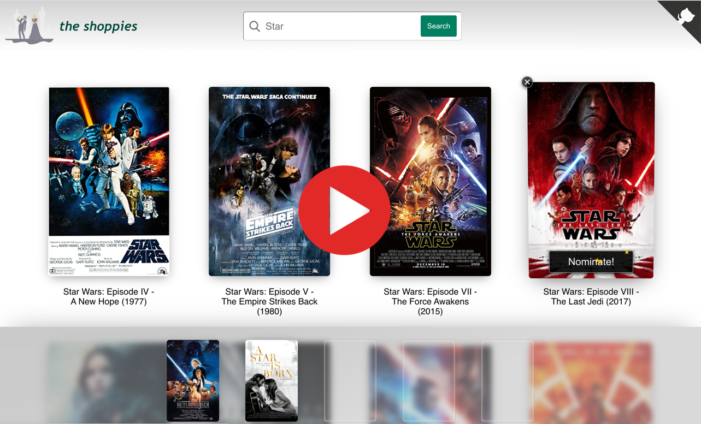

### 

### 
UX Developer Intern  & Web Developer Intern Challenge

## About

Movie awards for entrepreneurs! Shoppies is a single-page web app built in React that lets users search for movies using OMDB'S API and nominate five movies to receive a Shoppies Award!

#### <a href="https://nicolleromero.github.io/shoppies-app/">👉 Try it out here!</a>

### 

## Demo Video

<a href="http://www.youtube.com/watch?v=FTJ1xsxiiIk">Watch a demo of the app in action!</a>

### 

 

## Contents

- [Technologies](#tech-stack)
- [App Features](#app-features)
- [Future Improvements](#future-improvements)
- [About The Developer](#about-me)
- [Deployment](#deployment)
- [License](#license)

## Technologies

- React
- TypeScript
- [Recoil](https://recoiljs.org/) for state management
- [React Router](https://reactrouter.com/)
- [React Spring](https://github.com/pmndrs/react-spring)
- [React Flip Toolkit](https://github.com/aholachek/react-flip-toolkit)
- [React Modal](https://github.com/reactjs/react-modal)
- [React Content Loader](https://github.com/danilowoz/react-content-loader)
- [React Intersection Observer](https://github.com/thebuilder/react-intersection-observer)
- [React Tooltip](https://www.npmjs.com/package/react-tooltip)
- [OMDB API](https://www.omdbapi.com/)
- [Jest Testing Framework](https://jestjs.io/docs/en/tutorial-react)
- HTML
- CSS

## App Features

- Users can search OMDB to find movies they want to nominate for a Shoppies Award! ✨
- Movie posters are animated using [React Spring](https://github.com/pmndrs/react-spring) and [React Flip Toolkit](https://github.com/aholachek/react-flip-toolkit).
- Infinite scroll loads additional movies as the user scrolls and is implemented with [React Intersection Observer](https://github.com/thebuilder/react-intersection-observer) and [React Content Loader](https://github.com/danilowoz/react-content-loader).
- Movie details and ratings are provided in an accessible modal using [React Modal](https://github.com/reactjs/react-modal) and can be seen by clicking on a movie poster in the search results or the nominations footer.
- A user's nominations are saved to local storage so results will persist even if they leave the page.
- I chose to build with [Recoil](https://recoiljs.org/), an experimental state management library for React, because it offers an orthogonal approach to managing state. Selectors are used to handle asynchronous data fetching from OMDB's API.
- The design of the app is responsive and can be viewed on desktop or mobile.
- [Jest Testing Framework](https://jestjs.io/docs/en/tutorial-react) is used to test the end-to-end functioning of the app.
- Semantic markup and aria labels are used to support accessibility (and tested in Lighthouse and Axe).
- Users select five movies to complete their nominations! 🎉

## Future Improvements

- Refactor CSS to use Tailwind or a similar framework.
- Support users creating sharable links.
- Add more robust testing.

## About The Developer

Hi! 👋 I'm Nicolle, a graduate from Hackbright Academy’s Full-stack Software Engineering program and currently a Software Engineer Intern at PagerDuty. I'm part of the Frontend Growth Engineering team where I help build and maintain the UI for customer onboarding, checkout, and free trial signup flows. We work in React/Redux, Ruby/Rails, and Elixir/Phoenix with modern frontend CI/CD tools. I love logging in each day to collaborate with my team, tackle hard problems, learn new skills, and create UI that will be used by millions of people.

## Deployment

This project was bootstrapped with [Create React App](https://github.com/facebook/create-react-app).

### Available Scripts

In the project directory, you can run:

#### `yarn start`

Runs the app in the development mode. 
Open [http://localhost:3000](http://localhost:3000) to view it in the browser.

The page will reload if you make edits. 
You will also see any lint errors in the console.

#### `yarn test`

Launches the test runner in the interactive watch mode. 
See the section about [running tests](https://facebook.github.io/create-react-app/docs/running-tests) for more information.

#### `yarn build`

Builds the app for production to the `build` folder. 
It correctly bundles React in production mode and optimizes the build for the best performance.

The build is minified and the filenames include the hashes. 
Your app is ready to be deployed!

See the section about [deployment](https://facebook.github.io/create-react-app/docs/deployment) for more information.

### Learn More

You can learn more in the [Create React App documentation](https://facebook.github.io/create-react-app/docs/getting-started).

To learn React, check out the [React documentation](https://reactjs.org/).

#### Code Splitting

This section has moved here: https://facebook.github.io/create-react-app/docs/code-splitting

#### Analyzing the Bundle Size

This section has moved here: https://facebook.github.io/create-react-app/docs/analyzing-the-bundle-size

#### Making a Progressive Web App

This section has moved here: https://facebook.github.io/create-react-app/docs/making-a-progressive-web-app

#### Advanced Configuration

This section has moved here: https://facebook.github.io/create-react-app/docs/advanced-configuration

#### Deployment

This section has moved here: https://facebook.github.io/create-react-app/docs/deployment

## License

- MIT © Nicolle Romero 2021
- Homepage Illustration by Katerina Limpitsouni (unDraw: https://undraw.co/illustrations)
